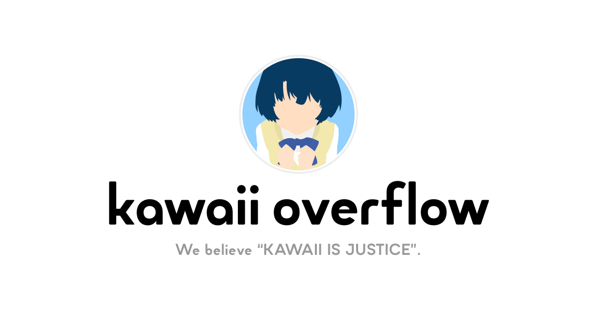

# KAWAII OVERFLOW

私たちはオープンソースソフトウェアの開発を通して、ACG([\*1](#note)) 文化へ貢献します。

## プロジェクト

- [arm](https://github.com/kawaiioverflow/arm)

## メンバー

- [@p-chan](https://github.com/p-chan)

## 連絡先

- [Twitter](https://twitter.com/kawaiioverflow)

## ノート

<small>\*1: ACG とは、アニメ、漫画、ゲーム、ライトノベル、ヴィジュアルノベル、ボカロ、東方、その他オタク文化のことを指します。</small>

---

Inspired by [MOEOVERFLOW](https://moeoverflow.com/)
